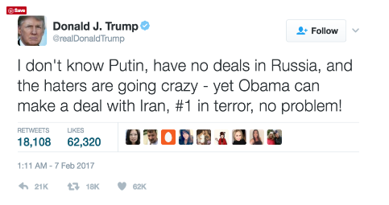
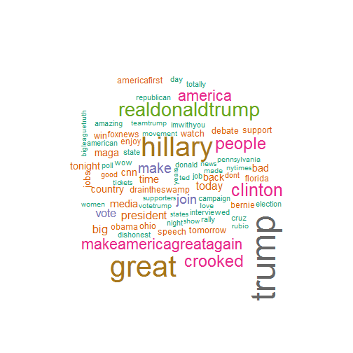

Word Cloud App: Donald Trump Tweets
========================================================
author: Patrick Boswell
date: February 12, 2017
autosize: true
font-family: 'Helvetica'


Problem:
========================================================

***

- Donald Trump is a prolific tweeter.
- Under standing what Mr. Trump's principle topics have been is difficult.

Solution:
========================================================

To solve this problem I have built an application that takes over 7000 tweets from Mr. Trump between Jan. 25, 2016 and Jan. 21, 2017. The application generates a word cloud of Mr. Trumps most frequently used words from this time period.  The application takes two inputs from the user to construct the word cloud: 

- Minimum frequency of word occurence in the tweet dataset
- Maximum number of words to display in the word cloud


Data:
========================================================

Data was retrieved as a .csv from: [Dataset](https://www.reddit.com/r/datasets/comments/5czkdz/7375_donald_trump_tweets_in_excel_and_csv/)

The following code was used to transform the dataset into a vector usable by the app:


```r
tweetdata <- read.csv("dttweetfull.csv") 

myCorpus <- Corpus(VectorSource(tweetdata[,3]))
myCorpus <- tm_map(myCorpus, content_transformer(tolower))
myCorpus <- tm_map(myCorpus, removePunctuation)
myCorpus <- tm_map(myCorpus, removeNumbers)
myCorpus <- tm_map(myCorpus, removeWords,
                   c(stopwords("SMART"), "the", "and", "but", "amp","‰û"))

myDTM = TermDocumentMatrix(myCorpus,
                           control = list(minWordLength = 1))

m = as.matrix(myDTM)

m <- sort(rowSums(m), decreasing = TRUE)
```

Word Cloud Plot:
========================================================
Example of the word cloud without the App functionality.



[Application Link](https://patrickboswell.shinyapps.io/donaldtrumptweets/)
